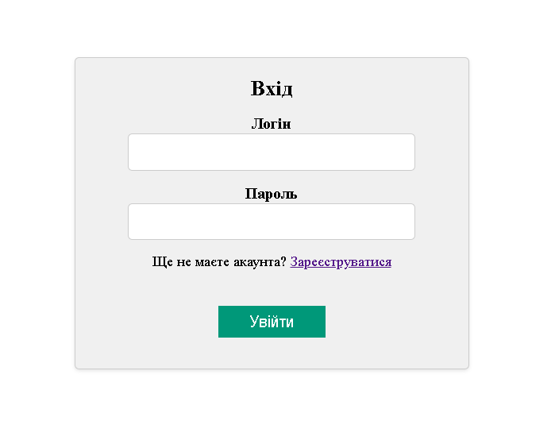
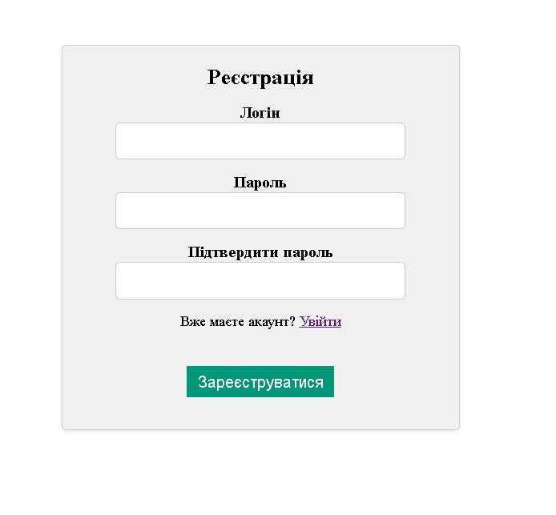
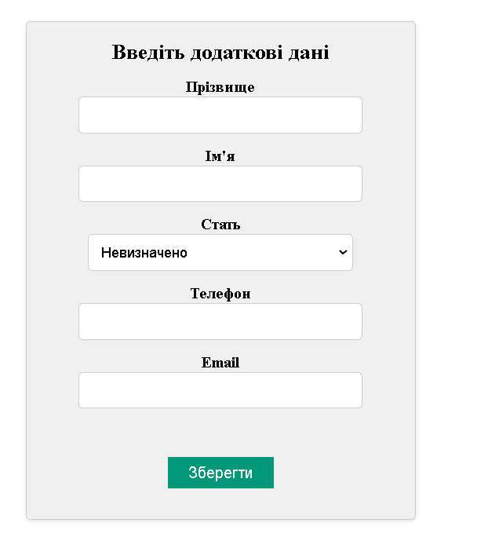
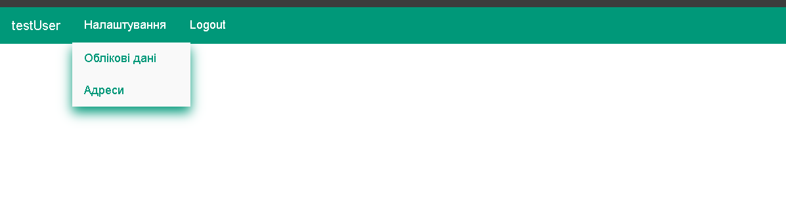
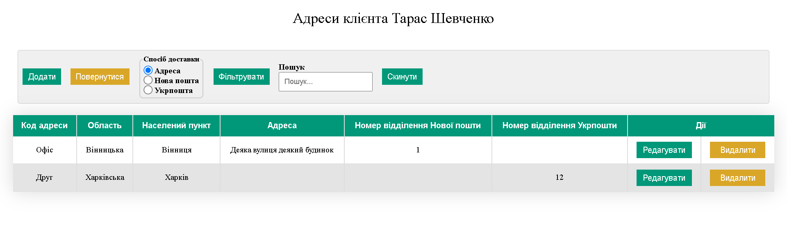
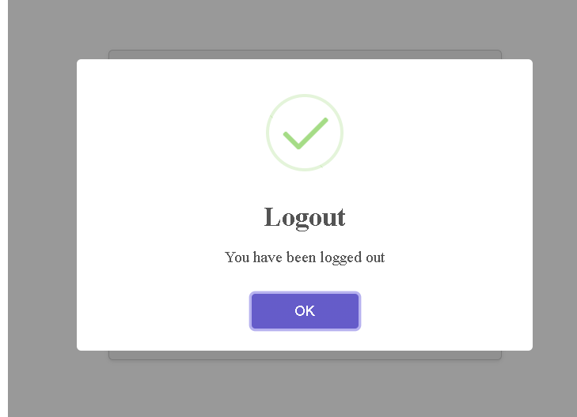
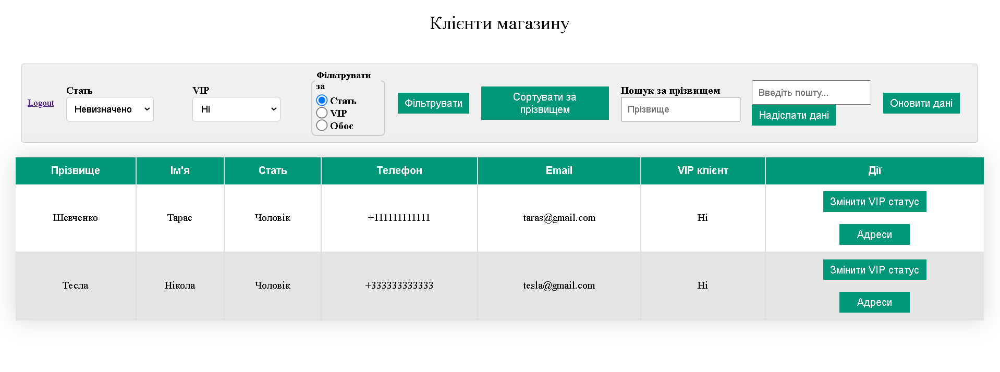

# Test project for learning Spring Boot
**Internet shop client management system**

 ---
## Summary 
1. Authentication and authorization with Spring Security
2. Role based permissions
3. Email sending 
4. Creation xlsx document based on data from the database 
5. Using thymeleaf template engine

---
## Roles
There are two types of application users: **USER** and **ADMIN**

**USER** creates their account and specifies additional details such as phone number, email,
first name, second name, and gender. Users can edit this data at any time. Users can also manage 
their addresses for goods delivery.

**ADMIN** can view all the shop clients. The Admin can change a client's status (VIP or not) and 
can view all the information about any client. There is also functionality for searching, sorting, 
and filtering clients. The Admin can generate an xlsx document about clients and send this document 
to an email.

---
## Screenshots

### Login form 

### Sign up form 

### User details form

### Client home page

### Addresses management

### Notifications

### Admin home page
